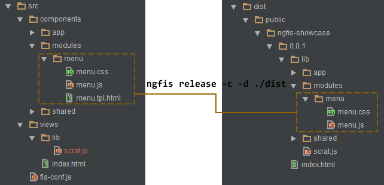

## 量身打造angular开发解决方案(3) - 开发规范和部署规范

> **解耦开发规范和部署规范是前端开发体系的设计重点。**


#### 0.开发概念定义
仿`scrat`的概念：

术语概念 | 描述
------------ | -------------
外部模块资源 | 生态环境中的第三方组件，包括JS模块、CSS模块
项目模块资源 | 内部的公共模块。
非模块化资源 | 并不是所有的开发资源都是模块化的，如页面资源， 模块化框架本身等。

我们的文件后缀名约定如下：

文件类型 | 后缀 | 描述
------------ | ------------- | -------------
脚本文件 | `*.js` , `*.coffie` |
样式文件 |  `*.css`, `*.sass` |
模板文件 |  `*.tpl.html` | 不会发布，需手动内嵌到JS
测试脚本 |  `*.spec.js` | 不会被发布
内嵌内容 |   `*.inline.*` | 有些文件希望分开编写，但发布的时候自动合并。
调试代码 |  `*.inject.js` | 在开发期自动插入到页面, 提供一些API的mock。<br/>（针对`HybridApp`）

---

#### 1.开发目录设计
```
- project
  - src
    - component_modules         **存放外部生态模块资源**
    - components                **存放项目模块资源**
      - app                       - angular主入口
      - shared                    - 内部公共模块 (私有模块)
      - modules                   - 业务模块目录
    - views                     **存放页面以及非模块化资源**
      - index.html                - HTML文件
      - lib                       - 存放其他非模块化类库
    - fis-conf.js               FIS的配置文件
    - server                    NodeJS服务端程序
```
- 模块化资源通过`require('modules/menu')`的方式调用，而views目录下的非模块化资源需要自行通过`script/link`引入。
- 模块化资源(`app`, `shared`, `modules`等)采用`organize by feature`的部署规范，
一个模块的JS、CSS、HTML，还有单元测试，都维护在一起。它们的子目录规范如下：

```
- modules                   - 业务模块目录
  - menu                       - 具体的业务模块
    - menu.js                    - 该模块入口 (同模块名, 视为模块入口)
    - menu.css                   - 该模块样式 (同模块名, 会自动依赖)
    - menu.tpl.html              - 该模块模板文件 (不会发布， 需手动内嵌到JS)
    - menu-xx.png                - 图片文件
    - menu.spec.js               - 该模块的单元测试
    - menu-helper.inline.js      - 该脚本不会发布， 需手动内嵌到JS
```

---

#### 2.部署目录设计


- 按版本部署，采用非覆盖式发布
- 以下文件不会发布：
  - `*.tpl.html`  (需内嵌到js文件，后文描述)
  - `*.inline.*`  (会被内嵌到其他文件)
  - `*.spec.js`   (仅在自动化测试时发布)
  - `*.inject.js` (仅在本地调试时嵌入)
  - 其他配置文件

目录结构如下：
```
- dist
  - public
    - 项目名称
      - 版本号
        - lib             **大部分资源都会部署到这个目录下**
          - angular         - 生态模块
          - menu            - 内部项目模块
          - scrat           - 非模块化资源, view目录下的lib
        - index.html
  - server                **NodeJS服务端程序**
  - test                  **测试文件**
```

---

#### 3. 设计工具，完成开发目录和部署目录的转换

> 所谓构建，其核心任务就是将文件按照某种规则进行分类（以文件后缀分类，以模块化/非模块化分类，以前端/后端代码分类），然后针对不同的文件做不同的构建处理。

准备了下示例项目：https://github.com/ng-workflow/ngfis-showcase

同时，也准备了工具项目：https://github.com/ng-workflow/ngfis

我们通过fis的配置文件来映射目录转换，参见`ngfis/config/default.js`的`roadmap.path`配置, 关键配置如下：
```
roadmap: {
  path: [
    //tpl.html文件不发布
    {
      reg: /.*\.tpl\.html$/,
      release: false
    },
    //component工程模块下的JS文件, 发布到public/lib目录下
    {
      reg : /^\/components\/(.*\.js)$/i,
      id : '${name}/${version}/lib/$1',
      isMod : true,
      useHash : false,
      url : '${urlPrefix}/${name}/${version}/lib/$1',
      release : '/public/${name}/${version}/lib/$1'
    },
    //view下的非模块化资源, 发布到public目录
    {
      reg : /^\/views\/(.*\.(?:html?|js))$/,
      useCache : false,
      isViews : true,
      url : '${urlPrefix}/${name}/${version}/$1',
      release : '/public/${name}/${version}/$1'
    },
  ]
```

> TIP： 在开发期，可以在工具项目中执行`npm link`即可实时更新。
>
> 并且为了方便调试，提供了`debug.js`，可以通过`webstorm`断点调试我们的工具。

在示例项目下执行 `ngfis release -d ./dist` 即可看到发布效果，so easy~




。
